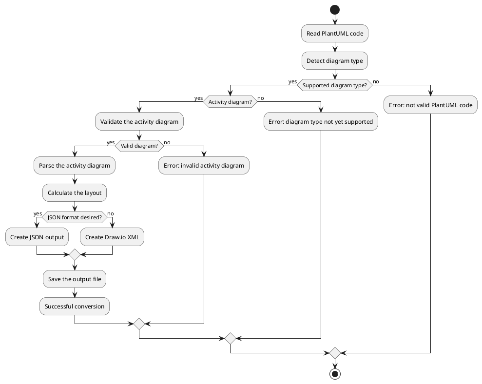
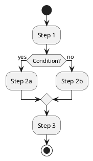

# Workflow

This document describes the detailed workflow for converting a PlantUML diagram into the Draw.io format.

## Overall process

The full conversion process consists of the following main steps:



## Step-by-step explanation

### 1. Read the PlantUML code

Users can supply a PlantUML diagram in two ways:

1. **Via the command line**:
   ```bash
   ./p2d-cli --input diagram.puml --output diagram.drawio
   ```

2. **Via the graphical interface**:
   - Start the GUI with `./p2d-gui`
   - Enter the PlantUML code in the text field, or
   - Load a PlantUML file via "Open File"

- **Responsible modules:** `src/plantuml2drawio/core.py` or `src/plantuml2drawio/app.py` (depending on interface)

### 2. Detect the diagram type

The system analyzes the PlantUML code and detects the diagram type by:

1. Looking for characteristic keywords and structures
2. Validating the diagram against known patterns
3. Selecting the appropriate processor for the detected type

- **Responsible module:** `src/plantuml2drawio/core.py`

### 3. Parse the PlantUML code

The corresponding processor extracts the diagram structure by:

1. Breaking the PlantUML code into its components
2. Identifying nodes (activities, decisions, start/end)
3. Identifying edges (connections between nodes)
4. Extracting labels and properties

- **Responsible module:** `src/processors/activity_processor.py`

### 4. Validate the activity diagram

- **Responsible module:** `src/processors/activity_processor.py`
- **Function:** `is_valid_activity_diagram(plantuml_content)`
- **Description:**
  - Check for required elements of an activity diagram
  - Verify PlantUML markers (@startuml, @enduml)
  - Check for basic elements (start, stop)
  - Ensure activity lines or if-blocks are present

### 5. Calculate the layout

- **Responsible module:** `modules/activity_processor.py`
- **Function:** `layout_activity_diagram(nodes, edges, ...)`
- **Description:**
  - Calculate optimal positions for all nodes
  - Use a recursive depth-first search algorithm (DFS)
  - Assign coordinates based on the hierarchy in the diagram
  - Special handling for branching and merging nodes

### 6. Create the output

- **Responsible module:** `modules/activity_processor.py`
- **Functions:**
  - `create_activity_drawio_xml(nodes, edges)` for Draw.io XML
  - `create_json(nodes, edges)` for JSON format
- **Description:**
  - For XML: build a Draw.io-formatted XML structure with correct styles and properties
  - For JSON: build a JSON representation of nodes and edges
  - Encode as UTF-8 to support special characters

### 7. Save the output file

- **Responsible modules:** `src/plantuml2drawio/core.py` or `src/plantuml2drawio/app.py` (depending on interface)
- **Functions:**
  - CLI: `write_output_file(content, file_path)`
  - GUI: file selection dialog in `convert_to_drawio()`
- **Description:**
  - Write the generated content to a file
  - CLI: use the provided or automatically determined filename
  - GUI: present a save dialog for the user

## Error handling

The system includes several layers of error handling:

1. **Early validation:**
   - Check for valid PlantUML code
   - Identify the diagram type
   - Perform diagram-specific validation for activity diagrams

2. **Structured exception handling:**
   - Try/except blocks around critical operations
   - Detailed error messages for each processing stage
   - Distinguish between I/O errors and processing errors

3. **User feedback:**
   - CLI: descriptive error messages on the console
   - GUI: status messages within the interface

## Example

A simple example for converting an activity diagram:



The result is a Draw.io XML file that can be opened in Draw.io, showing the same elements and connections using the Draw.io styling.
