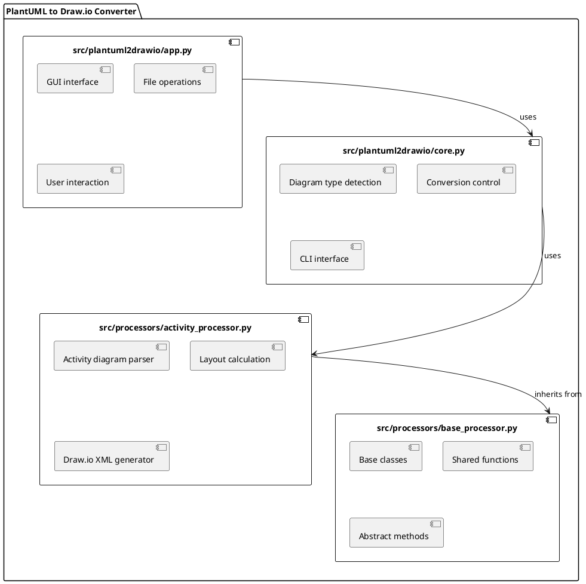

# Component Diagram

The following component diagram shows the main modules of the PlantUML to Draw.io converter and their dependencies:

## Main components

1. **src/plantuml2drawio/core.py**
   - Core component of the system
   - Controls the conversion process
   - Provides the command-line interface
   - Detects the diagram type
   - Coordinates processing

2. **src/processors/activity_processor.py**
   - Specialized component for activity diagrams
   - Parses PlantUML activity diagrams
   - Calculates the layout
   - Generates Draw.io XML

3. **src/plantuml2drawio/app.py**
   - Graphical user interface
   - Provides file operations
   - Visualizes the conversion process
   - Shows results and errors

4. **src/processors/base_processor.py**
   - Base class for all diagram processors
   - Defines the shared interface
   - Supplies base classes for diagram elements

## Component interactions

- **src/plantuml2drawio/core.py** handles coordination and shared functionality
- **src/processors/activity_processor.py** implements logic specific to activity diagrams
- **src/plantuml2drawio/app.py** focuses on UI concerns only
- **src/processors/base_processor.py** defines the common interface for all processors

## Modular architecture

The diagram highlights the clear separation of responsibilities between modules:

- **src/plantuml2drawio/core.py** manages coordination and generic functionality
- **src/processors/activity_processor.py** focuses exclusively on activity diagrams
- **src/plantuml2drawio/app.py** handles only UI-related aspects

This architecture simplifies future expansion to additional diagram types. New processors can be added as standalone modules without altering existing code.
