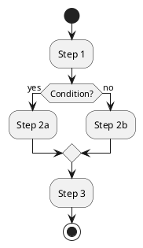

# PlantUML to Draw.io Converter - Documentation

This documentation outlines the structure, behavior, and usage of the PlantUML to Draw.io converter.

## Project Organization

The project is structured as follows:

```
plantuml2drawio/
├── README.md                    # Main documentation
├── LICENSE                      # License information
├── requirements.txt             # Python dependencies
├── setup.py                     # Installation script
├── .gitignore                   # Git ignore rules
├── plantuml2drawio-cli          # Command-line entry point
├── plantuml2drawio-gui          # GUI entry point
├── src/                         # Main source code
│   ├── plantuml2drawio/         # Core package
│   │   ├── core.py              # Core functionality
│   │   ├── app.py               # GUI application
│   │   └── config.py            # Configuration settings
│   └── processors/              # Diagram processors
│       ├── base_processor.py    # Base class for processors
│       └── activity_processor.py # Activity diagram processor
├── tests/                       # Tests
│   ├── test_diagram_type.py     # Diagram type detection tests
│   └── data/                    # Test data
├── docs/                        # Documentation
│   ├── Installation_und_Benutzung.md
│   ├── Arbeitsablauf.md
│   └── ... (additional docs)
├── examples/                    # Example diagrams
│   └── activity_examples/       # Activity diagram samples
└── resources/                   # Resources
    └── icons/                   # Application icons
```

## Quick Start

### Installation

```bash
# Clone the repository
git clone https://github.com/[username]/plantuml2drawio.git
cd plantuml2drawio

# Install in development mode
pip install -e .
```

### Usage

#### Command Line

```bash
# Using the entry point scripts
./p2d-cli --input path/to/diagram.puml --output path/to/diagram.drawio

# Or using the installed console scripts
p2d-cli --input path/to/diagram.puml --output path/to/diagram.drawio
```

#### Graphical User Interface

```bash
# Using the entry point scripts
./p2d-gui

# Or using the installed console scripts
p2d-gui
```

## Additional Documentation

- [Installation and Usage](Installation_und_Benutzung.md)
- [Workflow](Arbeitsablauf.md)
- [System Architecture](Systemarchitektur.md)
- [Extension Options](Erweiterungen.md)
- [Modules](Module.md)
- [Components](Komponenten.md)
- [System Overview](Systemuebersicht.md)

## Development

For contributors, the modular structure offers several advantages:

1. **Add new diagram types**: create a new processor in the `src/processors/` directory that inherits from `BaseDiagramProcessor`.
2. **Tests**: extend the tests in the `tests/` directory.
3. **Examples**: add examples in the `examples/` directory to demonstrate functionality.

The project follows common Python standards, making it straightforward to extend and maintain.

## Project Overview (duplicate for convenience)

A tool for converting PlantUML diagrams into the Draw.io format.

<p align="center">
  
</p>

### 📋 Overview

This project converts PlantUML diagrams into Draw.io format, enabling seamless integration of UML diagrams into various documentation and presentation workflows. The converter currently supports activity diagrams and is being expanded to additional diagram types.

### ✨ Key Features

- 🔄 Conversion of PlantUML activity diagrams to Draw.io format
- 🔍 Automatic detection of the PlantUML diagram type
- 🖥️ User-friendly GUI as well as command-line interface
- 📐 Automatic layout calculation for optimal diagram rendering
- 🧩 Modular design for easy extensibility

### 🚀 Quick Start

#### Installation

```bash
# Clone repository
git clone https://github.com/[username]/plantuml2drawio.git
cd plantuml2drawio

# Install dependencies
pip install -r requirements.txt
```

#### Usage

##### Command Line

```bash
python p2d-cli --input diagrams/activity.puml --output diagrams/activity.drawio
```

##### Graphical User Interface

```bash
./p2d-gui
```

### 📚 Documentation

Comprehensive documentation is available in the `docs` directory:

- [Installation and Usage](Installation_und_Benutzung.md)
- [Workflow](Arbeitsablauf.md)
- [System Architecture](Systemarchitektur.md)
- [Extension Possibilities](Erweiterungen.md)

### 🧪 Examples

#### Activity Diagram

**PlantUML Input**:


**Draw.io Output**:

<p align="center">
  
</p>

### 🛠️ Technology Stack

- Python 3.6+
- tkinter for the GUI
- Regular expressions for parsing
- XML libraries for Draw.io generation

### 🗺️ Roadmap

- [x] Support for activity diagrams
- [ ] Support for sequence diagrams
- [ ] Support for class diagrams
- [ ] Support for component diagrams
- [ ] Advanced layout management
- [ ] Integration with PlantUML server
- [ ] Web interface

### 🤝 Contributing

Contributions are welcome! Please read our [Contribution Guidelines](../CONTRIBUTING.md) for more information.

### 📄 License

This project is licensed under the MIT License - see the [LICENSE](../LICENSE) file for details.
