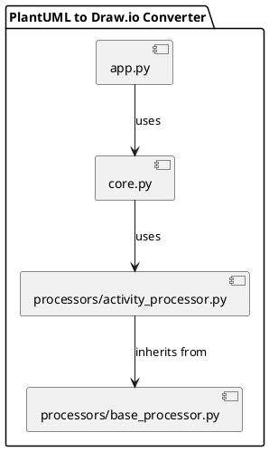
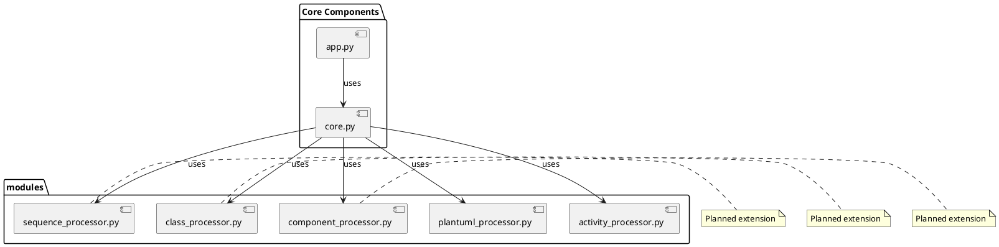

# System Architecture

This document describes the current architecture of the PlantUML to Draw.io converter.

## Overview

The system is modular and consists of the following main components:

1. **core.py**: The core component that orchestrates the conversion process
2. **processors/activity_processor.py**: Module for processing activity diagrams
3. **processors/base_processor.py**: Base class for all diagram processors
4. **app.py**: Graphical user interface for the converter

## Component diagram

## Components in detail

### core.py

The core component handles:

1. Parsing command-line arguments
2. Detecting the PlantUML diagram type
3. Selecting the corresponding processing module
4. Coordinating the conversion process
5. Producing the desired output format

### processors/activity_processor.py

Specialized module for handling activity diagrams:

- Parse PlantUML activity diagram code
- Calculate the layout for diagram elements
- Generate the Draw.io XML format for activity diagrams

#### Key functions:

- `parse_plantuml_activity(plantuml_content)`: Extracts nodes and edges from PlantUML code
- `layout_activity(nodes, edges)`: Calculates a sensible layout for diagram elements
- `create_drawioxml_activity(nodes, edges)`: Generates Draw.io XML for an activity diagram
- `create_json(nodes, edges)`: Creates a JSON representation of the diagram

### processors/base_processor.py

Base class for all diagram processors:

- Contains shared functions and attributes
- Provides an interface for all processors

### app.py

The graphical user interface offers:

1. A text field for entering PlantUML code
2. Functions to load and save files
3. A button to start the conversion
4. Diagram type detection
5. Status messages

## Data flow

The typical flow through the system:

1. **Input**: PlantUML code (from file or GUI)
2. **Diagram type detection**: Determine the type via `determine_plantuml_diagram_type()`
3. **Specialized processing**: Route to the appropriate processor (currently activity diagrams)
4. **Parsing**: Extract diagram elements (nodes and edges)
5. **Layout calculation**: Determine the position of each element
6. **XML generation**: Create Draw.io-compatible XML
7. **Output**: Save as a Draw.io file (or display in the GUI)

## Future architecture

With planned support for additional diagram types, the architecture will expand as follows:

Each new diagram module will implement a similar interface to preserve the system's extensibility.
